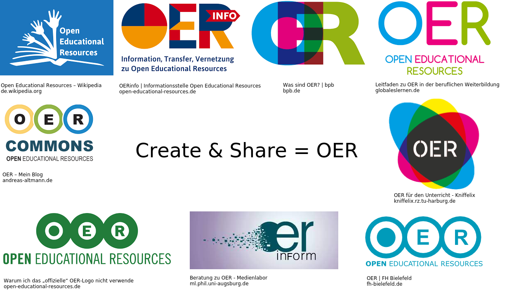
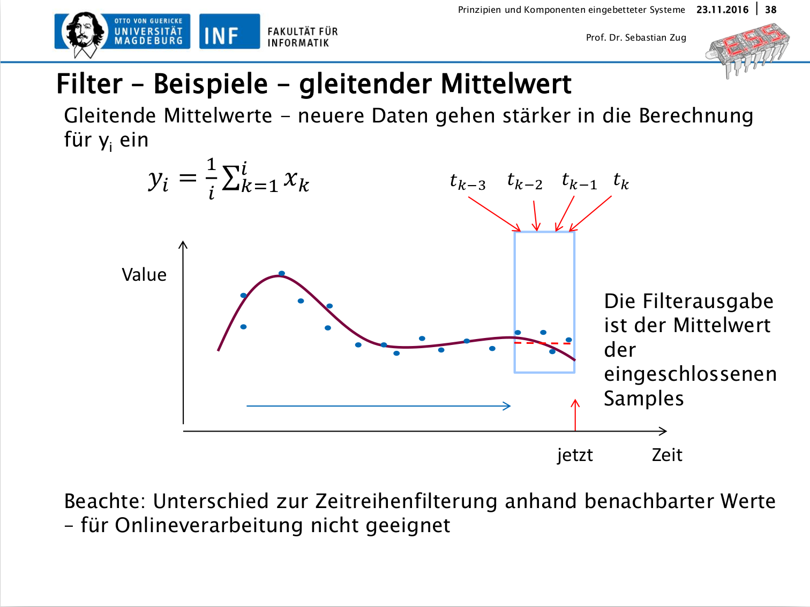
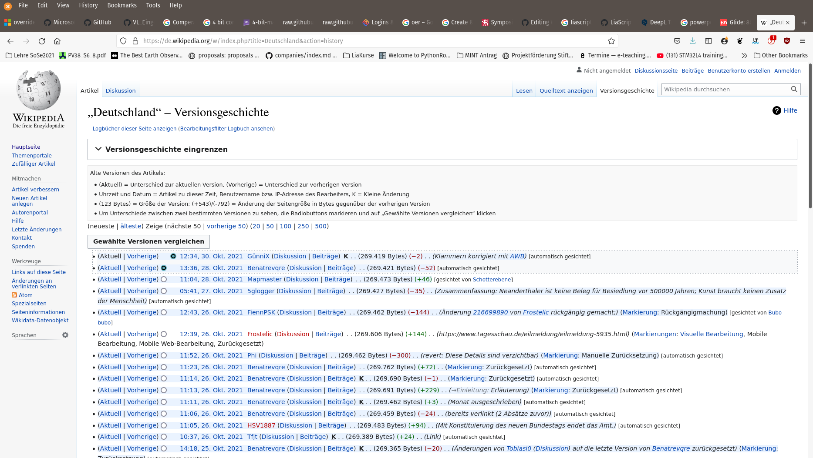

<!--
author:   André Dietrich & Sebastian Zug

email:    LiaScript@web.de

version:  0.0.1

language: en

narrator: US English Male

comment:  Try to write a short comment about
          your course, multiline is also okay.

import:   https://raw.githubusercontent.com/liaTemplates/AVR8js/main/README.md
          https://liascript.github.io/course/?https://github.com/liascript/CodeRunner

script:
          https://jauhl.github.io/mecEdit/scripts/g2.js
          https://jauhl.github.io/mecEdit/scripts/mec2.min.js
          https://jauhl.github.io/mecEdit/scripts/mecelement/canvasInteractor.js
          https://jauhl.github.io/mecEdit/scripts/mecelement/g2.selector.js
          https://jauhl.github.io/mecEdit/scripts/mecelement/mec.htmlelement.js


@mec
<lia-keep>
<MEC-2 width=800 height=600 grid cartesian darkmode x0=385 y0=139 >
@0
</MEC-2>
</lia-keep>
@end
@mec.eval: @mec.eval_(@uid)
@mec.eval_
<script>
let json=`@input`
document.getElementById("@0").innerHTML = "<MEC-2 id='test' width=1530 height=680 grid cartesian darkmode x0=385 y0=139 >" + json + "</MEC-2>"
"LIA: stop"
</script>
<div id="@0"></div>
@end

-->

[](https://liascript.github.io/course/?https://raw.githubusercontent.com/LiaPlayground/Symposium-on-International-Teaching-2021/main/README.md)

# Create & Share Interactive online-courses with LiaScript

{{0-1}}


                              {{0-2}}
************************************

> ##### Symposium Internationale Lehre, Technische Universität Braunschweig, 19.11.2021
>
> **André Dietrich, Sebastian Zug**
>
>  _This material was designed with LiaScript and is available by the [Link](https://github.com/LiaPlayground/Symposium-on-International-Teaching-2021)_

************************************

                             --{{1}}--
These are Sebastian and André your hosts of the today's session about creating and sharing online-courses with LiaScript. If you want to, you can try out different presentation styles by switching them within the settings. Additionally, if you want this course to be served within another language, try out the experimental google-translation.

                              {{1-2}}
<div style="display: flex; flex-wrap: wrap; gap: 12px;">

<!-- style="flex: 1 0 48%; min-width:320px; margin: 0 6px 6px 0;"-->
> 
> __Sebastian Zug__ is Professor of Software Engineering and Robotics at
> TU Bergakademie Freiberg. His technical research focuses on outdoor robotics
> and the modeling of sensor errors in these scenarios. In addition, he works on
> concepts and tools for the digitalization of teaching. The main focus is on
> the collaborative development of OER teaching materials and cooperatively used
> remote laboratories. In this area, Sebastian Zug coordinates several national
> research projects.
>
> **Contact: [Sebastian.Zug@informatik.tu-freiberg.de](mailto:Sebastian.Zug@informatik.tu-freiberg.de)**

<!-- style="flex: 1 0 48%; min-width:320px; margin: 0 6px 6px 0;"-->
> 
> __André Dietrich__ is originally a robotics and embedded software developer,
> now working as a researcher at the TU Bergakademie Freiberg. Due to struggles
> with common Learning-Management-Systems and authoring-systems, he started the
> development on LiaScript, a language-based approach for creating interactive
> and open online-courses. His current research interests are language design,
> new web technologies and online education with focus on open educational
> resources.
>
> **Contact: [Andre.Dietrich@informatik.tu-freiberg.de](mailto:Andre.Dietrich@informatik.tu-freiberg.de)**

</div>

---

## Motivation


     {{0-1}}
********************************************************************************

    --{{0}}--
How should teaching materials be created that really deserve the OER idea? They
should be freely available AND manipulable. Some protagonists of the community
emphasize the first aspect and annotate a PDF document as open. But courses on a
topic are very different, a teacher sets varying priorities or chooses another
contexts. Hence, the offer of a usage is not enough. Furthermore, it is necessary
to provide materials that can be revised and newly compiled. The Figure
illustrates this. A number of authors corrected errors and developed content
that goes into different directions. This also results in completely new course
configurations or translations of content. But which basic expectations have to be implemented to meet this goal?


```ascii   *Versions of the content of a course and their reuse in other contexts*

Version 1.0                           Version 1.1
+---------------------------+          +---------------------------+
| Course  German Literatur  |          | Course  German Literature |
| Authors John Muster       | "Error"  | Authors John Muster       |
|                           |------->  |         Angelika Maier    |----->
|~~~~~~~~~~~~~~~~~~~~~~~~~~~|          |~~~~~~~~~~~~~~~~~~~~~~~~~~~|
| In 1756 Goethe visited    |---.      | In 1786 Goethe visited    |--.
| Italy ...                 |   |      | Italy ...                 |  |
                                |                                     |
                                |                                     |    +----------------------------+
                                |                                     |    | Course  Deutsche Literatur |
                                |                                     |    | Authors John Muster        |
                                |                                     .--> |         Angelika Maier     |
                                |                                          |         Steve Gray         |
                                |                                          |~~~~~~~~~~~~~~~~~~~~~~~~~~~~|
                                |                                          | 1786 reiste Goethe nach    |
                                |                                          | Italien ...                |
                                |       Version 1.0
                                |      +---------------------------+
                                |      | Course  Goethe & Schiller |
                                |      | Authors John Muster       |
                                .-->   |         Angelika Maier    |----->
                                       |~~~~~~~~~~~~~~~~~~~~~~~~~~~|
                                       | The correspondence during |
                                       | the Italian journey ...   |
```

---


**Conditions for implementation:**

+ Freely available editors and tools
+ Integrated sharing mechanims
+ Automated version management
+ Support of interactive content
+ Concepts for internationalization

********************************************************************************


    {{1-2}}
********************************************************************************

    --{{1}}--
Would it be possible to implement this idea in standard slide formats? I guess you can answer this question by yourself if you tested the integrated version management in PowerPoint for instance. Of course, the sharing mechanisms are easy to realize by just copying a file, but you have no control or overview about new versions provided by another lecturer. Additionally, the capabilities to provide interactive content are very limited.



---

| Expectations and goals | Methods                                         |
| ---------------------- | ----------------------------------------------- |
| Editor tools           | ... separate open source or commercial software |
| Sharing mechanims      | ... by copying files                            |
| Version management     | ... only direct line predecessors               |
| Interactive content    | ... limited                                     |
| Internationalization   | ... have to be done manually                    |

********************************************************************************


     {{2-4}}
********************************************************************************

> Wikipedia as a web-based system has brought together millions of authors and
> users. Why does this project succeeds?



    --{{2}}--
Wikipedia has a different approach that is much closer to the OER idea. The German entry for "Federal Republic of Germany" looked back on 15850 changes
in May 2019. 3928 users have contributed to this. Wikipedia thus ensures the
timeliness and quality of the data stock. But where is the key to success?
Wikipedia stores the entire history of a document. This makes it possible to reconstruct changes, to merge versions, and thus, to discuss or eliminate errors very easy.

---

| Expectations and goals | Methods                      |
| ---------------------- | ---------------------------- |
| Editor tools           | ... embedded into website    |
| Sharing mechanims      | ... website                  |
| Version management     | ... complete                 |
| Interactive content    | ... non existent             |
| Internationalization   | ... have to be done manually |

********************************************************************************

      {{3-4}}
> Wikipedia provides an integrated editor directly connected with the version system!

     --{{3}}--
The content in Wikipedia is edited in a simple description language, [wikitext](https://de.wikipedia.org/wiki/Wikitext). The syntax combines specific symbols for defining titles, paragraphs, and images with the actual content. Unlike Word or PDF documents, a wikitext is a simple text file. Users can make changes in the description language directly within the browser. No separate tool and installation are necessary. LiaScript was motivated by this idea but combines the concept with requierments of an Learning managment system.


## LiaScript - Basic Concepts

                             --{{0}}--
The development on LiaScript started as a side-project within the
["Industrial eLab"](http://www.elab.ovgu.de/Das+Projekt.html) project in
Magdeburg. You can check out the following video resource, which shows an
earlier version of the system as well as an historical outline.

                              {{0-1}}
!?[Open Course Development with Liascript](https://www.youtube.com/watch?v=w_CRABsJNKA)


                             --{{1}}--
We needed a way of providing educational content for programming courses and
thought that a language-based approach instead of a tooling- or platform-based
might provide a higher degree of freedom, exchangeability, and sustainability,
next to some other benefits.


                               {{1}}
* Completly text-based content representation
* No backend required
* Works offline (PWA)
* Open-Source development and Versioning
* Faster development cycles
* ... and more


                             --{{2}}--
And finally, we wanted to have a system that can be used for different purposes,
we wanted to use it for presentations, but in the same way also for developing
interactive books, or to have something like YouTube-screencast with automated
text-to-speech output.


### Purely Text based content


      --{{0}}--
In order to flatten the learning curve and to not reinvent the wheel, we decided
to rely on Markdown. But, we also wanted to have an extendable language with
support for interactivity and beyond the possibilities of today's Learning
Management Systems.

> LiaScript **based** the description language Markdown.

        {{1-2}}
********************************************************************************

      --{{1}}--
Markdown is a pretty simple Markup-language to learn. Everything starts with a `#`
or heading. The number of hashtags defines the heading number. In LiaScript
these headings are also used as separators between different "slides". A
paragraph is simply a block of text/sentences that are separated by an empty
line. Thus, empty lines do not only provide a visual separator for the author,
but posses also a semantic value as separators between blocks. By the way, it
makes no difference if you use only one or multiple empty lines.

**Markdown content:**

<!-- class="translate"-->
```markdown
# Headline 1

That's a paragraph!

## Headline 2

_**Highlighted text** in italic font_

* Point 1
* Point 2

... and an embedded Equation $a=cos(b)$!
```

---

**Resulting output:**

<h1>Headline 1</h1>

That's a paragraph!

<h2>Headline 2</h2>

_**Highlighted text** in italic font_

* Point 1
* Point 2

... and an embedded Equation $a=cos(b)$!

---

********************************************************************************

          {{2}}
********************************************************************************

          --{{2}}--
Tables are also self-explanatory. The only thing that is relevant in this case
is the use of colons within the separators between the head and the body. The
position of colons is used as an indicator of whether the column should be
aligned to the left, right, or centered. The LiaScript interpreter adds the
possibility to sort the table by clicking onto the sort-button on the right
corner of every column header.

**Markdown Content:**

<!-- class="translate"-->
``` markdown
| Tables               |      Are      |  Cool |
| -------------------- |:-------------:| -----:|
| *** columns 3 is *** | right-aligned | $1600 |
| ** column 2 is **    |   centered    |   $12 |
| * zebra stripes *    |   are neat    |    $1 |
```

---

**Resulting output:**

| Tables               |      Are      |  Cool |
| -------------------- |:-------------:| -----:|
| *** columns 3 is *** | right-aligned | $1600 |
| ** column 2 is **    |   centered    |   $12 |
| * zebra stripes *    |   are neat    |    $1 |


********************************************************************************


### Interactive Elements

> LiaScript **extends** the description language Markdown by
> animations, interactive elements, and a macro-system.

          {{1-3}}
********************************************************************************

**Tables & Data**

    --{{1}}--
Thus, if you see the following table, how would you visualize it?

``` markdown
<!--
data-title="Government expenditure on education"
data-xlabel="year"
data-ylabel="% of GDP"
data-show="true"
-->
| Year | Finland |     USA | Germany |   China |
| ---- | -------:| -------:| -------:| -------:|
| 1995 | 6.80942 |         | 4.42079 | 1.84192 |
| 1996 | 6.86052 |         | 4.48319 | 1.85338 |
| 1997 |         |         |         |         |
| 1998 |         |         | 4.45345 | 1.84432 |
| 1999 | 5.86960 |         |         | 1.88803 |
| 2000 | 5.71687 |         |         |         |
| 2001 | 5.84797 |         |         |         |
| ...  | ...     |         |         |         |
```

    --{{2}}--
Probably also as a line-chart, and this is what LiaScript does as well. It tries
to find patterns for the most appropriate visualization.

     {{2-3}}
<!--
data-title="Government expenditure on education"
data-xlabel="year"
data-ylabel="% of GDP"
data-show="true"
-->
| Year | Finland |     USA | Germany |   China |
| ---- | -------:| -------:| -------:| -------:|
| 1995 | 6.80942 |         | 4.42079 | 1.84192 |
| 1996 | 6.86052 |         | 4.48319 | 1.85338 |
| 1997 |         |         |         |         |
| 1998 |         |         | 4.45345 | 1.84432 |
| 1999 | 5.86960 |         |         | 1.88803 |
| 2000 | 5.71687 |         |         |         |
| 2001 | 5.84797 |         |         |         |
| 2002 | 6.02477 |         |         |         |
| 2003 | 6.17476 |         |         |         |
| 2004 | 6.16849 |         |         |         |
| 2005 | 6.03605 |         |         |         |
| 2006 | 5.93809 |         | 4.27930 |         |
| 2007 | 5.68608 |         | 4.34302 |         |
| 2008 | 5.84676 |         | 4.40954 |         |
| 2009 | 6.48517 |         | 4.88047 |         |
| 2010 | 6.54070 | 5.42001 | 4.91368 |         |
| 2011 | 6.48200 | 5.22389 | 4.80779 |         |
| 2012 | 7.19254 | 5.19485 | 4.93331 |         |
| 2013 | 7.15848 | 4.94378 | 4.93496 |         |
| 2014 | 7.15155 | 4.98948 | 4.93112 |         |


********************************************************************************

         {{3-5}}
********************************************************************************

**Quizzes**

    --{{3}}--
Quizzes in LiaScript, as we hope, are self-explanatory and are always associated
with brackets or brackets in combination with parenthesis.


    --{{4}}--
For example a multiple-choice quizzes can be defined as follows, only with the
power of your keyboard. No further configuration is required. And if you want to
convert it into a single-choice quiz, simply replace the inner brackets by
parenthesis.


      {{4}}
******************************************************************

<!-- class="translate"-->
```markdown
What is the solution of $y=2x+3$ for $x=5$?

    [[X]] 13
    [[ ]] 17
    [[ ]] 3
    [[?]] Replace x by the actual value 5 in the equation.
****************************************

This is the explanation ... $ y(5) = 2x+3 = 2\cdot 5 + 3 = 10 $

??[Prince of Persia 4D](https://archive.org/details/msdos_4D_Prince_of_Persia_1994)

****************************************
```

---

What is the solution of $y=2x+3$ for $x=5$?

    [[X]] 13
    [[ ]] 17
    [[ ]] 3
    [[?]] Replace x by the actual value 5 in the equation.
****************************************

This is the explanation ... $ y(5) = 2x+3 = 2\cdot 5 + 3 = 10 $

??[Prince of Persia 4D](https://archive.org/details/msdos_4D_Prince_of_Persia_1994)

****************************************

******************************************************************

********************************************************************************


         {{5}}
********************************************************************************

**External Components**

                      --{{5}}--
And finally, if want to embed an external resource and you have no idea of how
to do that, you can also rely on our extension to links. Simply add two question
marks. In this case LiaScript will try to oEmbed the content of the link or at
least try to add this as an iframe.

``` markdown
??[anatomy of the eye](https://sketchfab.com/3d-models/the-human-eye-extrinsic-muscle-contraction-20-dc9c88630b6c42a8b242fd6024d0697f)
```

??[anatomy of the eye](https://sketchfab.com/3d-models/the-human-eye-extrinsic-muscle-contraction-20-dc9c88630b6c42a8b242fd6024d0697f)

********************************************************************************


### Presentations, Books, etc.

    --{{0}}--
Everything that is related to animations, is associated to braces. Double braces
at the beginning of a block indicate the point in time when something should
appear or disappear. Braces surrounded by dashes can be interpreted as the
explanation for a specific point. That's it, if you change the representation of
the course, these elements will be treated differently.

<!-- class="translate"-->
``` markdown
    --{{1}}--
See this important table.

     {{1-2}}
| I   | appear    | at  | first |
| --- | --------- | --- | ----- |
| and | disappear | at  | two   |

     {{2}}
* I will remain till the end
* and do have some {3}{__inline animations__}
* inline effects can also {3-4}{disappear} ...

    --{{2}}--
The bullet point list is also quite important, it contains some sub effects

    --{{3 Russian Female}}--
Первоначально создан в 2004 году Джоном Грубером (англ. John Gruber) и Аароном
Шварцем. Многие идеи языка были позаимствованы из существующих соглашений по
разметке текста в электронных письмах...
```

    --{{1}}--
See this important table.

     {{1-2}}
| I   | appear    | at  | first |
| --- | --------- | --- | ----- |
| and | disappear | at  | two   |


      {{2}}
* I will remain till the end
* and do have some {3}{__inline animations__}
* inline effects can also {3-4}{disappear} ...

    --{{2}}--
The bullet point list is also quite important, it contains some sub effects

    --{{3 Russian Female}}--
Первоначально создан в 2004 году Джоном Грубером (англ. John Gruber) и Аароном
Шварцем. Многие идеи языка были позаимствованы из существующих соглашений по
разметке текста в электронных письмах...

    --{{4}}--
If you try out the experimental Google translation, you will find out that
everything gets translated and also the voice will change, except for the
Russian text, this will remain.


### Plugins for different lectures

> LiaScript can be extended by individual plugins interacting with JavaScript Libraries.

                         {{0-1}}
********************************************************************************

**1. Computer Science (Contributor Yannik Höll)**

```` markdown
```cpp
#include <iostream>

int main() {
  int max = 0;
  std::cout << "How many Hellos?";

  std::cin >> max;

  for(int i=0; i<max; i++)
  printf ("Hello, world %d!\n", i + 1);

  return 0;
}
```
@LIA.eval(`["main.c"]`, `g++ main.c -o a.out`, `./a.out`)
````

```cpp Main.cpp
#include <iostream>

int main() {
  int max = 0;
  std::cout << "How many Hellos?";

  std::cin >> max;

  for(int i=0; i<max; i++)
  printf ("Hello, world %d!\n", i + 1);

  return 0;
}
```
@LIA.eval(`["main.c"]`, `g++ -Wall main.c -o a.out`, `./a.out`)

********************************************************************************

                       {{1-2}}
********************************************************************************

**Mechanical Engineering (Contributor TU Chemnitz)**

``` json @mec
{
  "id":"chaos-pendulums",
  "gravity":true,
  "nodes": [
    { "id":"A0","x":200,"y":400,"base":true },
    { "id":"A1","x":280,"y":480,"m":2 },
    { "id":"B1","x":279,"y":481,"m":2 },
    { "id":"C1","x":278,"y":482,"m":2 },
    { "id":"D1","x":277,"y":483,"m":2 },
    { "id":"A2","x":360,"y":560,"m":3 },
    { "id":"B2","x":359,"y":561,"m":3 },
    { "id":"C2","x":358,"y":562,"m":3 },
    { "id":"D2","x":357,"y":563,"m":3 },
    { "id":"A3","x":440,"y":640,"m":4.7 },
    { "id":"B3","x":439,"y":641,"m":4.7 },
    { "id":"C3","x":438,"y":642,"m":4.7 },
    { "id":"D3","x":437,"y":643,"m":4.7 }
  ],
  "constraints": [
    { "id":"a1","p1":"A0","p2":"A1","len":{ "type":"const" } },
    { "id":"a2","p1":"A1","p2":"A2","len":{ "type":"const" } },
    { "id":"a3","p1":"A2","p2":"A3","len":{ "type":"const" } },
    { "id":"b1","p1":"A0","p2":"B1","len":{ "type":"const" } },
    { "id":"b2","p1":"B1","p2":"B2","len":{ "type":"const" } },
    { "id":"b3","p1":"B2","p2":"B3","len":{ "type":"const" } },
    { "id":"c1","p1":"A0","p2":"C1","len":{ "type":"const" } },
    { "id":"c2","p1":"C1","p2":"C2","len":{ "type":"const" } },
    { "id":"c3","p1":"C2","p2":"C3","len":{ "type":"const" } },
    { "id":"d1","p1":"A0","p2":"D1","len":{ "type":"const" } },
    { "id":"d2","p1":"D1","p2":"D2","len":{ "type":"const" } },
    { "id":"d3","p1":"D2","p2":"D3","len":{ "type":"const" } }
  ],
  "views": [
    { "show":"pos","of":"A3","as":"trace","id":"view1","stroke":"rgba(255,0,0,.5)" },
    { "show":"pos","of":"B3","as":"trace","id":"view2","stroke":"rgba(0,255,0,.5)" },
    { "show":"pos","of":"C3","as":"trace","id":"view3","stroke":"rgba(255,255,0,.5)" },
    { "show":"pos","of":"D3","as":"trace","id":"view4","stroke":"rgba(255,0,255,.5)" }
  ]
}
```

********************************************************************************


### Workflow


`````````
Generation                     Publication          Usage

                                                           .-----------.           Modes:
    | LiaScript Plugin A                            ╔══════| Browser   |══════╗
    |  | Plugin B                           native  ║      '-----------'      ║"- Textbook        "
    v  v                                  +-------> ║ Digital Systems         ║"- Presentation    "
+---------------------+                   |         ║ (Sprint 2021)           ║"- Slides          "
| # Digital Systems   |\          .-,(  ),-.        ╚═════════════════════════╝
| (Sprint 2021)       +-+      .-(          )-.            .-----------.
|                       | --> (     Cloud      )    ╔══════| LMS       |══════╗
|"##"Introduction       |      '-(         ).-'     ║      '-----------'      ║
| + ...                 |         '-.( ).-' SCORM   ║ Digital Systems         ║
+-----------------------+                 +-------> ║ (Sprint 2021)           ║
                                          |         ╚═════════════════════════╝
                                          |                .-----------.
                                          |         ╔══════| pdfViewer |══════╗
                                          | export  ║      '-----------'      ║
                                          +-------> ║ Digital Systems         ║
                                                    ║ (Sprint 2021)           ║
                                                    ╚═════════════════════════╝

"- Atom Editor with LiaScript Extention           "|"- [Github](https://github.io)         "
"- [CodiLia](https://github.com/liascript/codilia)"|"- [Dropbox](https://www.dropbox.com)  "
"  Online Editor @TUBAF                           "|"- [IPFS](https://ipfs.io), ...        "
                                                   |
                                                   |
`````````

 {{1}}
| Expectations and goals | Methods                                       |
| ---------------------- | --------------------------------------------- |
| Editor tools           | ... generic text or online editor             |
| Sharing mechanims      | ... via Github, DropBox, IPFs etc.            |
| Version management     | ... using git                                 |
| Interactive content    | ... implements a plugin concept               |
| Internationalization   | ... automated translation (work in progress ) |


### ... Sharing via


                --{{0}}--
So how can you share your course with others? Actually you can put your course
anywhere. The only thing that is required is the URL to your Markdown document.

                 {{0-1}}
`https://liascript.github.io/course/?YOUR_COURSE_URL.md`


    --{{1}}--
In order to have a strict version-control with support for multiple authors,
versions, branches, etc. You can use any kind of online plattform like GitHub or
GitLab, but also others.

      {{1}}
* ### Plattforms with Version-Control:

  1. [GitHub](https://github.com)
  2. [GitLab](https://gitlab.com)
  3. ...


    --{{2}}--
The Internet was a peer to peer system from its very beginning, but now also
multiple projects catch on upon this idea, by integreating such features also
directly into the browser, which allows to share content and entire websites
directly from your local computer.


      {{2}}
* ### Peer To Peer Systems with Browser-Support

  1. [Brave-Browser](https://brave.com) with [IPFS](https://ipfs.io)
  2. [Beaker-Browser](https://beakerbrowser.com) with [Hyper](https://hypercore-protocol.org)
  3. ...


    --{{3}}--
And of course, you can upload your course documents to any ordinary webstore.


      {{3}}
* ### Online stores

  1. [DropBox](https://www.dropbox.com)
  2. [NextCloud](https://nextcloud.com/)
  3. ... any ordinary webstore


     --{{4}}--
Or, directly share and edit it with others in a collaborative online editor,
such as CodiMD or in our case CodiLia.

       {{4}}
* ### Collaborative online editors ...

  1. [CodiLia](https://github.com/liascript/codilia)
  2. ...


## Advanced Concepts

         --{{0}}--
Puhhh ... a lot of information for 20 minutes! Please take a closer view to our
examples and documentations for diving deeper into LiaScript.

* __Project-Website:__ https://LiaScript.github.io
* __Open-Source:__ https://github.com/liascript
* __YouTube:__ https://www.youtube.com/channel/UCyiTe2GkW_u05HSdvUblGYg
* __Additional resources:__

  - Documentation: https://github.com/LiaScript/docs
  - Free books: https://github.com/LiaBooks
  - Templates: https://github.com/LiaTemplates
  - Talks & ...: https://github.com/LiaPlayground
  - Blog: https://aizac.herokuapp.com

* __Editor:__ https://atom.io

  - Liascript-Preview: https://atom.io/packages/liascript-preview
  - Liascript-Snippets: https://atom.io/packages/liascript-snippets

* __Development-Server:__ https://www.npmjs.com/package/@liascript/devserver


## Save the date

                            --{{0}}--
We plan to dive into LiaScript in detail during a online-tutorial in December.


1. **When?**  **Thursday, December 9th, 7pm**
2. **Where?** https://teach.informatik.tu-freiberg.de/b/seb-p67-jav-pw9
3. **[Add to your calender](./workshop.ics)**

              {{1}}
<div style="width:100%;height:0;padding-bottom:87%;position:relative;"><iframe src="https://giphy.com/embed/13qctMBrrgbwJi" width="100%" height="100%" style="position:absolute" frameBorder="0" class="giphy-embed" allowFullScreen></iframe></div><p><a href="https://giphy.com/gifs/video-games-game-mario-13qctMBrrgbwJi">via GIPHY</a></p>
